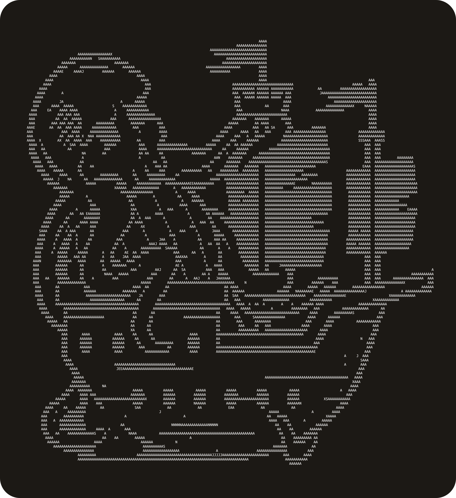
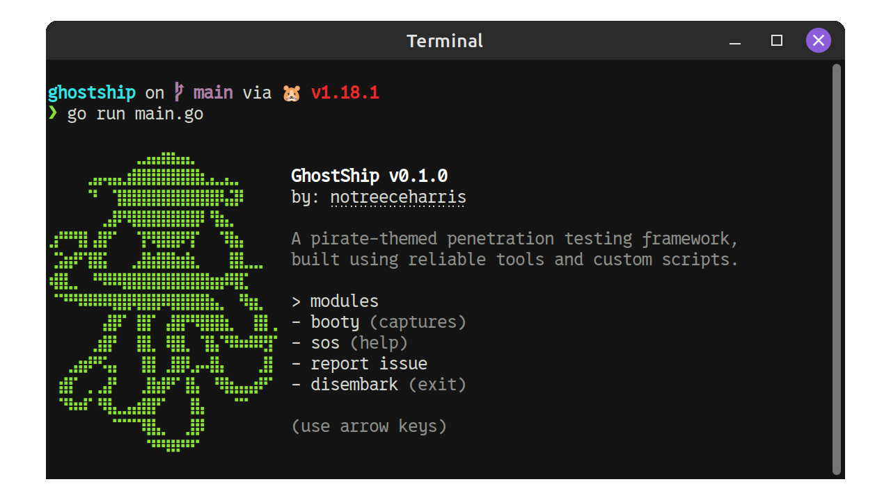

<p align="center">
    
    <h1 align="center">Ghost Ship Framework 🏴‍☠️</h1>
</p>

<details>
    <summary>Preview</summary>
    
</details>

## Setup

```
go mod tidy

# Run GhostShsiteip
go run ./src/.
```

## Dependencies

- Python 3.x
- Golang >= 1.18.x
